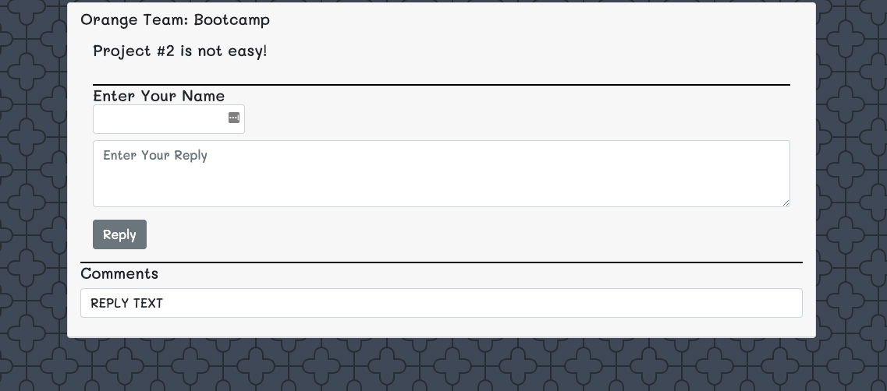

# Shower Thoughts
Cutting edge music wShower Thoughts is an app where you can share and reply to  thoughts or questions about any topic. 
This is a browser app; works on the desktop and mobile devices.

# Criteria provider by the client:**

Our customer would like to have an application where users can share thoughts on any topics or post questions for others to answer.

```
WHEN click on create post
WOULD like to see a text box to enter a username and a thought
WHEN click on view all 
WOULD like to see all the thoughts
```

# How to use the Shower Thoughts:

Shower Thoughts application works with Node.js. Also, it uitlize MySQL as the database. Before using this app consider the following:

* Install NPM
* Enter database name "shower_thoughts_bd" and MySQL password 
* Inside of MySQL create the database only "shower_thoughts_bd"
* Run Server.js
* Open local host

# Mockups:





# Resources:

* Visual Code - used to modify html and css files
* Google developer tools - to test changes
* Chrome, Safari, Firefox - to ensure page render correctly
* Bootstrap CSS Framework
* Google Fonts
* Bootstrap CSS
* Node + Express 
* Handlebars Template
* MySQL & Sequelize
* Heroku


# Repository:

* Repository: https://github.com/ibarrasb/Project1
* Heroku: 
* Presentation: https://drive.google.com/file/d/18Fnocsam9SyXYz7KXX2oibOGzAYLScFM/view?usp=sharing

